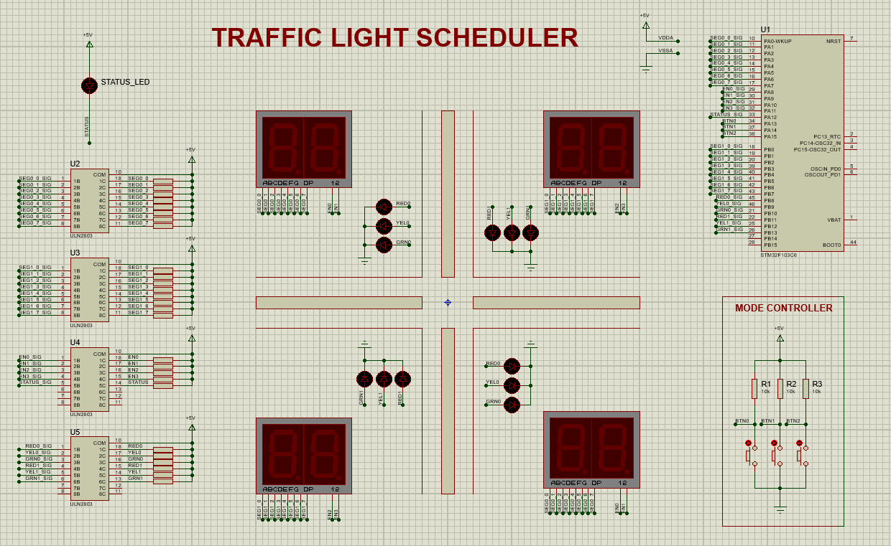

# [MCU] LAB4: SCHEDULER

The pin assignments are listed in the table below:

| PIN      | PIN LABEL      | PIN      | PIN LABEL      |
|:---------|:---------------|:---------|:---------------|
| PA0      | SEG0_0_SIG     | PB0      | SEG1_0_SIG     |
| PA1      | SEG0_1_SIG     | PB1      | SEG1_1_SIG     |
| PA2      | SEG0_2_SIG     | PB2      | SEG1_2_SIG     |
| PA3      | SEG0_3_SIG     | PB3      | SEG1_3_SIG     |
| PA4      | SEG0_4_SIG     | PB4      | SEG1_4_SIG     |
| PA5      | SEG0_5_SIG     | PB5      | SEG1_5_SIG     |
| PA6      | SEG0_6_SIG     | PB6      | SEG1_6_SIG     |
| PA7      | SEG0_7_SIG     | PB7      | SEG1_7_SIG     |
| PA8      | EN0_SIG        | PB8      | RED0_SIG       |
| PA9      | EN1_SIG        | PB9      | YEL0_SIG       |
| PA10     | EN2_SIG        | PB10     | GNR0_SIG       |
| PA11     | EN3_SIG        | PB11     | RED1_SIG       |
| PA12     | STATUS_SIG     | PB12     | YEL1_SIG       |
| PA13     | BTN0           | PB13     | GRN1_SIG       |
| PA14     | BTN1           | PB14     | not in use     |
| PA15     | BTN2           | PB15     | not in use     |